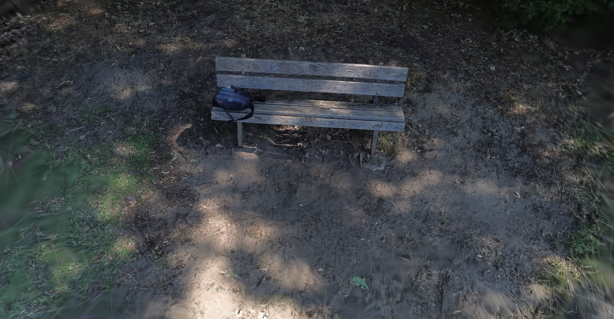

# gaussian_splatting_recipe

This repository provides a pipeline for converting DJI drone video into a 3D Gaussian Splatting model. It executes frame
extraction, automated object masking, feature matching, and Gaussian splat optimization.

## Example Outputs

- 
- 

---

## Installation Steps

Follow these steps to set up the environment in the correct order:

1. **Install Core Dependencies (fVDB & PyTorch):**
   ```bash
   pip install fvdb-reality-capture fvdb-core==0.5.0+pt211.cu130 --extra-index-url="[https://d36m13axqqhiit.cloudfront.net/simple](https://d36m13axqqhiit.cloudfront.net/simple)" torch==2.11.0 --extra-index-url [https://download.pytorch.org/whl/cu130](https://download.pytorch.org/whl/cu130)
   ```

2. **Install Python Requirements:**
   ```bash
   pip install -r requirements.txt
   ```

3. **Install Hierarchical-Localization (HLOC):**
   ```bash
   git clone --recursive https://github.com/cvg/Hierarchical-Localization/
   cd Hierarchical-Localization/
   python -m pip install -e .
   cd ../
   ```

---

## How It Works (Step-by-Step)

* **`pipeline_hloc.py` (Data Prep & Structure from Motion):**
  Extracts frames from an input `.mp4` DJI video. Optionally uses Grounding DINO (e.g., prompt "bench. backpack.") to
  generate binary bounding-box masks for specific objects. It generates sequential image pairs and runs the HLOC
  pipeline (SuperPoint and LightGlue) to output a single-pinhole COLMAP reconstruction.
* **`visualize_matches.py` (Diagnostics):**
  Loads keypoints and matches from the HLOC HDF5 databases. It maps coordinates and draws the matches between random
  image pairs to verify feature matching accuracy.
* **`train_splat.py` (Gaussian Optimization):**
  Creates symlinks for `sparse`, `images`, and `masks` directories for fVDB parsing. Loads the COLMAP data, sets
  Gaussian growth and refinement parameters, trains the model (without optimizing camera poses), and exports the result
  as `gaussian_model.ply`.
* **`splat_viewer.html` (Web Viewer):**
  A PlayCanvas-powered web viewer. Drag and drop the generated `gaussian_model.ply` file into the browser to orbit and
  navigate the 3D scene.

---

## How to Run

Set your variables and execute the scripts in order:

**1. Setup Environment Variables:**

```bash
TRIAL="trial2"
FOLDER="ABC"
TRIAL_PATH="/media/${FOLDER}/0138F8B62CE26963/colmap/${TRIAL}"
```

**2. Extract Frames and Run HLOC:**

```bash
python gaussian_splatting/pipeline_hloc.py \
    --video /media/${FOLDER}/0138F8B62CE26963/videos/DJI_0010.MP4 \
    --output_dir ${TRIAL_PATH}/ \
    --focus_objects
```

**3. Visualize the Feature Matches (Optional):**

```bash
python gaussian_splatting/visualize_matches.py \
    --image_dir ${TRIAL_PATH}/images \
    --features ${TRIAL_PATH}/hloc_outputs/features.h5 \
    --matches ${TRIAL_PATH}/hloc_outputs/matches.h5 \
    --output_dir ${TRIAL_PATH}/hloc_outputs/visualizations \
    --num_pairs 10
```

**4. Train and Export the Gaussian Splat:**

```bash
python gaussian_splatting/train_splat.py \
    --trial_dir ${TRIAL_PATH}/ \
    --images_path ${TRIAL_PATH}/images \
    --masks_path ${TRIAL_PATH}/masks \
    --output_splat ${TRIAL_PATH}/gaussian_model.ply
```

**5. View the Result:**
Open `splat_viewer.html` in a web browser and drop your `gaussian_model.ply` file onto the page.