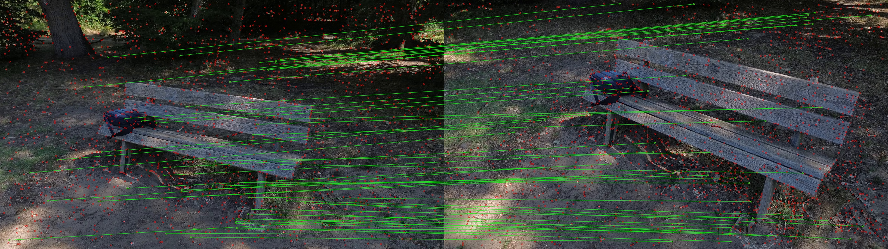
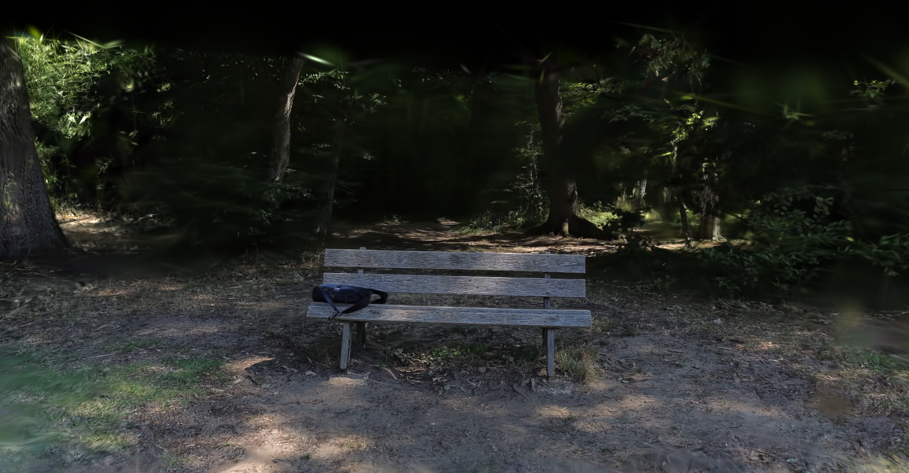
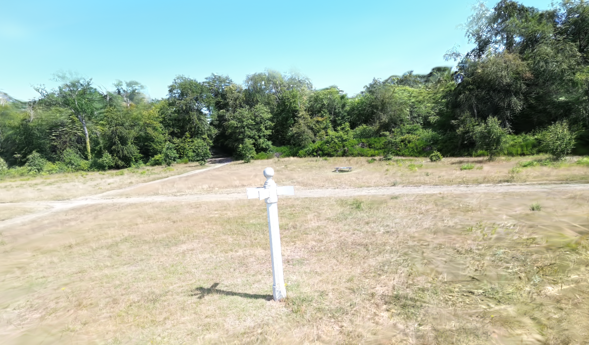
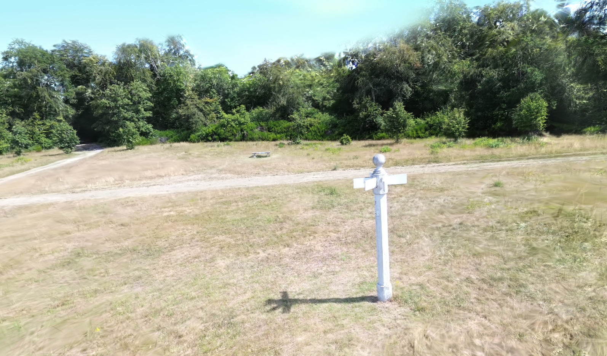

## Open-Source Gaussian Splatting with a Beginner Drone

### What is Gaussian Splatting?

Gaussian splatting is an alternative to traditional 3D polygon meshes. Instead of building surfaces out of polygons, it represents a physical space using millions of tiny 3D points (Gaussians) that blend together to create photorealistic models. It is fast, highly compute-efficient, and powerful enough for high-end VFX. This guide skips the heavy math and gives developers and hobbyists the raw intuition needed to build these pipelines from scratch.

### The Drone: DJI Mini 3

I captured the source footage using a DJI Mini 3. At around **€200** to **€300**, it is an accessible entry point with a built-in gyroscope for solid camera stability and direct-to-SD high-def recording. It provides exactly the high-quality source material needed for this workflow.

If you are going to capture your own footage, here are some critical tips to get the best results:

* Switch your camera from Auto to Pro mode.
* Set your shutter speed to **1/1000** to eliminate motion blur, as blur will heavily degrade the quality of your splats.
* In the drone's parameters, lower the maximum rotation and movement velocities and increase the smoothness. This prevents jerky, sudden movements.
* Ensure the scene you are filming is very well lit, otherwise your footage will be too dark at a high shutter speed.
* Move slowly and ensure you capture the subject from all possible angles.
* Make sure you have a high amount of overlap between your frames.
* Always check your local regulations to ensure you are legally allowed to fly in your chosen area.

### The Open-Source Pipeline

I opted for open-source tools over automated cloud services. Building the pipeline manually gives you direct control over the hyper-parameters and a much deeper understanding of the underlying mechanics.

**Step 1: Structure from Motion (SfM)**
The first critical step is Structure from Motion. This process takes your 2D video frames and estimates the camera poses, camera intrinsics, and the 3D positions of points in space to create a 3D point cloud. While DJI embeds some telemetry data, it is not granular enough for Gaussian splatting.

To handle this, we use HLOC (Hierarchical Localization). HLOC uses neural networks as feature extractors. Specifically, it uses SuperPoint to extract key features from the images, and then uses a network like SuperGlue or LightGlue to match those features between different frames. This establishes the mathematical constraints needed to estimate the camera positions and build the point cloud. For visualization and reference, we rely on COLMAP.

**Step 2: Gaussian Splatting with fVDB**
With the camera poses and point cloud generated, we move on to the actual Gaussian splatting. For this, I used fVDB Reality Capture. It is an open-source library provided by NVIDIA. It is relatively new and has a few bugs, but the source code is very clean and easy to read.

The main thing you need to focus on here is a specific hyper-parameter: the threshold used to split the Gaussians. The software estimates the Gaussians in 3D space, and depending on a set of heuristics, it decides whether to split them, delete them, or add more. You need to control this lever carefully. If you set the threshold too aggressively, the model adds Gaussians too quickly and results in a degenerate solution. If you set it too conservatively, the model will not capture enough detail. The goal is to set the threshold so that Gaussians are added relatively slowly and consistently until the end of the training process.

### Hardware & Performance Stats

If you are wondering what kind of hardware you need to run this locally, here is what my setup and processing times looked like:

* **Hardware:** NVIDIA **RTX 3080**
* **Dataset Size:** **400 images** extracted from the drone video
* **SfM Processing Time:** ~**20 minutes**
* **fVDB Training Time:** ~**40 minutes** (for **200 epochs**)
